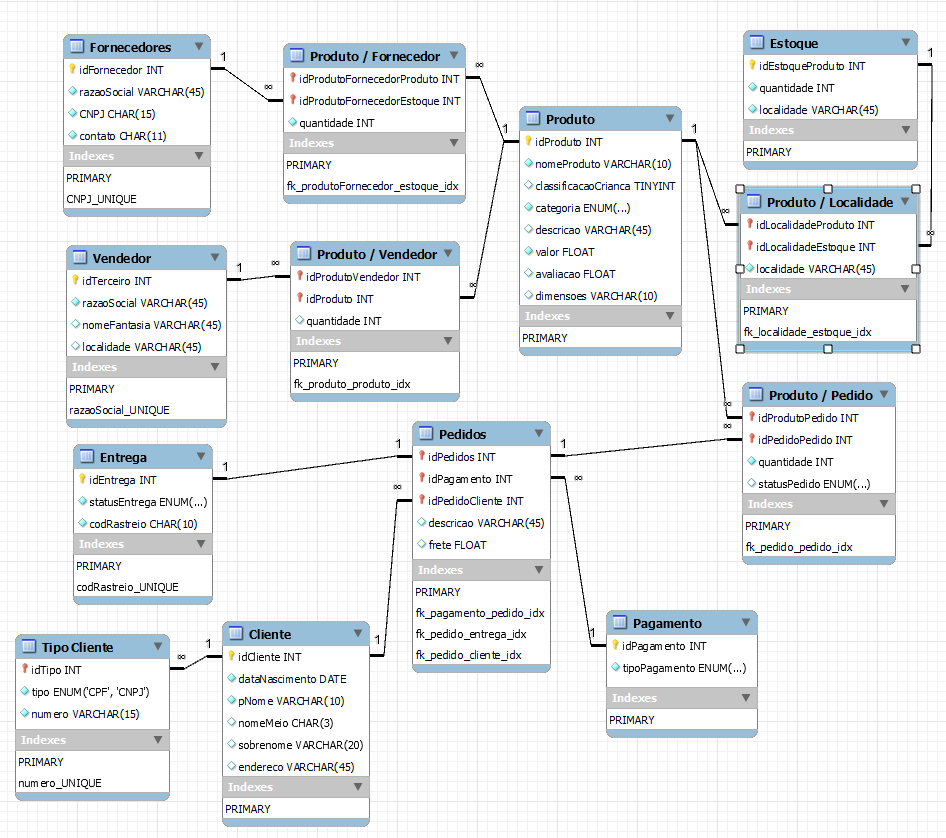

# Bootcamp Potência Tech - Banco de Dados E-Commerce

  


# Sobre o Projeto

Desenolvido em Julho de 2023 durante o bootcamp **Potência Tech Powered by iFood | Ciência de Dados com Python!** oeferecido pela **Digital Innovation One (DIO)** 
em parceria com a **IFood**, o projeto apresenta um exemplo de banco de dados de um e-commerce inspirado na solução de [Lucas Venancio de Araujo](https://github.com/lucasvda). Foram inseridas queries e criadas tabelas seguindo o modelo proposto durante o curso.

# Tecnologias Utilizadas

- [MySQL 8.0.34](https://dev.mysql.com/downloads/installer/) 


# Como Clonar o Projeto

- Instale o [Git](https://git-scm.com/downloads) no seu computador. Durante a instalação, certifique-se se a opção **Git Bash** está adicionada.
- Após a instalação, crie uma pasta em sua área de trabalho
- Dentro da pasta, clique com o botão direito e selecione **Git Bash Here**
- Após abrir o terminal, copie o seguinte comando:
   
```bash
git clone https://github.com/PhilTisoni/ecommerce_sql.git
```
O projeto deverá ser clonado para a sua pasta. Abra o arquivo .sql em seu Workbench.


# Índice

- <a href = "#Regras-de-Negócio">Regras de Negócio</a>
- <a href = "#Projeto">Projeto</a>
- <a href = "#Conclusão">Conclusão</a>
- <a href = "#Autor">Autor</a>

  
# Regras de Negócio

Replique a modelagem do projeto lógico de banco de dados para o cenário de e-commerce. Fique atento as definições de chave primária e estrangeira, 
assim como as constraints presentes no cenário modelado. Perceba que dentro desta modelagem haverá relacionamentos presentes no modelo EER. 
Sendo assim, consulte como proceder para estes casos. Além disso, aplique o mapeamento de modelos aos refinamentos propostos no módulo de modelagem conceitual.

O projeto deve conter:

- Mapeamento do esquema ER para Relacional
- Definição do script SQL para criação do esquema de banco de dados
- Persistência de dados para testes
- Recuperação de informações com queries SQL

Assim como demonstrado durante o desafio, realize a criação do Script SQL para criação do esquema do banco de dados. Posteriormente, realize a persistência
de dados para realização de testes. Especifique ainda queries mais complexas dos que apresentadas durante a explicação do desafio. Sendo assim, 
crie queries SQL com as cláusulas abaixo:

- Recuperações simples com SELECT Statement
- Filtros com WHERE Statement
- Crie expressões para gerar atributos derivados
- Defina ordenações dos dados com ORDER BY
- Condições de filtros aos grupos – HAVING Statement

Deste modo, o projeto deve: 

- Criar junções entre tabelas para fornecer uma perspectiva mais complexa dos dados
Diretrizes
- Não há um mínimo de queries a serem realizadas;
- Os tópicos supracitados devem estar presentes nas queries;
- Elabore perguntas que podem ser respondidas pelas consultas;
- As cláusulas podem estar presentes em mais de uma query;
- Ser adicionado a um repositório do Github para futura avaliação do desafio de projeto. Adicione ao Readme a descrição do projeto
lógico para fornecer o contexto sobre seu esquema lógico apresentado.


# Projeto

Inicialmente, foi realizado o mapeamento do esquema ER, entendendo os relacionamentos entre as tabelas para facilitar a criação do esquema do banco




A partir da interpretação do esquema, foram implementados os códigos para o script criando as tabelas e inserindo dados para a persistência, como 
demonstrado no exemplo abaixo:

```mySql
CREATE TABLE estoquesLocalidades (
    idEstoqueLocalidadeProduto INT,
    idEstoqueLocalidadeEstoque INT,
    localidade VARCHAR(45) NOT NULL,
    PRIMARY KEY (idEstoqueLocalidadeProduto, idEstoqueLocalidadeEstoque),
    CONSTRAINT fk_estoqueLocalidade_produto FOREIGN KEY (idEstoqueLocalidadeProduto) REFERENCES produtos (idProduto),
    CONSTRAINT fk_estoqueLocalidade_estoque FOREIGN KEY (idEstoqueLocalidadeEstoque) REFERENCES estoquesProdutos (idEstoqueProduto)
);

-- Inserindo valores na tabela clientes
INSERT INTO clientes (pNome, nomeMeio, sobrenome, endereco, dataNascimento) 
VALUES 
    ('João', 'S', 'Silva', 'Rua A, 123 - Bairro X - São Paulo/SP', '1995-08-20'),
    ('Ana', 'L', 'Pereira', 'Av. B, 456 - Bairro Y - Rio de Janeiro/RJ', '1980-05-10'),
    ('Pedro', 'M', 'Santos', 'Rua C, 789 - Bairro Z - Belo Horizonte/MG', '2000-11-25'),
    ('Mariana', 'N', 'Oliveira', 'Rua D, 987 - Bairro W - Porto Alegre/RS', '1972-03-15'),
    ('Fernando', 'T', 'Costa', 'Av. E, 654 - Bairro V - Curitiba/PR', '1998-12-08'),
    ('Carla', 'V', 'Rodrigues', 'Rua F, 321 - Bairro U - Brasília/DF', '1985-06-30');
```

Foram elaboradas 3 perguntas utilizando queries:

## Clientes que Fizeram Compras Utilizando PIX:

Esta query retorna o nome completo dos clientes que fizeram compras utilizando o método de pagamento PIX, juntamente com a quantidade 
total de compras feitas por cada cliente usando esse método:

```mySql
SELECT CONCAT(c.pNome, ' ', COALESCE(c.nomeMeio, ''), ' ', c.sobrenome) as Nome_Completo, COUNT(*) as Quantidade
FROM clientes c
JOIN pedidos p ON c.idCliente = p.idPedidoCliente
JOIN pagamentos pag ON p.idPedidoPagamento = pag.idPagamento
WHERE pag.tipoPagamento = 'PIX'
GROUP BY c.idCliente;
```

## Produtos em Estoque em Cada Localidade:

 Essa query retorna o nome do produto, a localidade do estoque e a quantidade em estoque para cada produto em cada localidade:

```mySql
SELECT p.nomeProduto, el.localidade as Localidade, e.quantidade as Quantidade_Estoque
FROM produtos p
JOIN estoquesLocalidades el ON p.idProduto = el.idEstoqueLocalidadeProduto
JOIN estoquesProdutos e ON el.idEstoqueLocalidadeEstoque = e.idEstoqueProduto;
```

## Valor Total dos Pedidos por Tipo de Pagamento

Esta query retorna o tipo de pagamento e o valor total dos pedidos realizados com cada método de pagamento (Cartão, PIX, Boleto, Dois Cartões).

```mySql
SELECT pag.tipoPagamento, SUM(ped.valor) as Valor_Total_Pedidos
FROM pedidos ped
JOIN pagamentos pag ON ped.idPedidoPagamento = pag.idPagamento
GROUP BY pag.tipoPagamento;
```

É importante destacar que no início do script foi adicionada uma validação que verifica se o banco de dados 
existe e o exclui caso exista. É uma medida preventiva para garantir que o banco de dados esteja limpo e sem 
informações residuais antes de criar todas as tabelas novamente.
Dessa forma, ao executar o script várias vezes, ele garantirá que não haja problemas de duplicação ou conflitos.

```mySql
-- Drop the database if it exists
DROP DATABASE IF EXISTS ecommerce_refinado;

-- Create the database
CREATE DATABASE ecommerce_refinado;
USE ecommerce_refinado;
```

# Conclusão

Esse estudo foi desafiador e exigiu diversas fontes de pesquisa para instalação do Workbench e assimilação do conteúdo, porém, apresenta a simulação completa de todos 
os processos para a criação da modelagem de um banco de dados para um e-commerce. Assim, adiciono alguns links úteis que podem complementar o estudo:

- [Instalação MySQL](https://www.youtube.com/watch?v=gffMzD8IsRk&feature=youtu.be)
- [Como Fazer Modelo Entidade Relacionamento](https://www.youtube.com/watch?v=ica1CB_S4jE)
- [Comandos para Queries](https://www.youtube.com/watch?v=DUYnl5CS0Po)
- [Comandos de Agrupamento - JOIN](https://www.youtube.com/watch?v=165r4qUvp8Q)


# Autor

- [Phelipe Augusto Tisoni](https://www.linkedin.com/in/phelipetisoni "Phelipe Linkedin")
