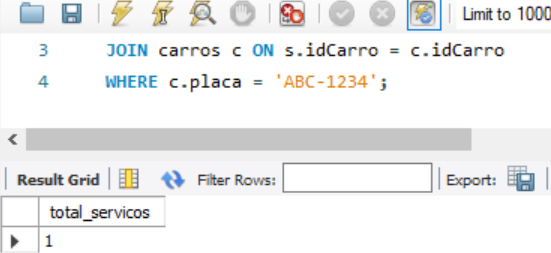

# Bootcamp Potência Tech - Oficina

  


# Sobre o Projeto

Desenolvido em Julho de 2023 durante o bootcamp **Potência Tech Powered by iFood | Ciência de Dados com Python!** oferecido pela **Digital Innovation One (DIO)** 
em parceria com a **IFood**, o projeto apresenta um exemplo de banco de dados de uma oficina, obtendo a concepção e implementação de um modelo original,
sem referências prévias.


# Índice

- <a href = "#Regras-de-Negócio">Regras de Negócio</a>
- <a href = "#Projeto">Projeto</a>
- <a href = "#Autor">Autor</a>

  
# Regras de Negócio

Para este cenário você irá utilizar seu esquema conceitual, criado no desafio do módulo de Modelagem de 
Banco de Dados com Modelo Entidade-Relacionamento, para criar o esquema lógico para o contexto de uma 
oficina. Neste desafio, você definirá todas as etapas. Desde o esquema até a implementação do banco de 
dados. Sendo assim, neste projeto você será o protagonista. Tenha os mesmos cuidados, apontados no 
desafio anterior, ao modelar o esquema utilizando o modelo relacional.

Após a criação do esquema lógico, realize a criação do Script SQL para criação do esquema do banco de dados.
Posteriormente, realize a persistência de dados para realização de testes. Especifique ainda queries mais 
complexas do que apresentadas durante a explicação do desafio. Sendo assim, crie queries SQL com as cláusulas abaixo:

- Recuperações simples com SELECT Statement;
- Filtros com WHERE Statement;
- Crie expressões para gerar atributos derivados;
- Defina ordenações dos dados com ORDER BY;
- Condições de filtros aos grupos – HAVING Statement;
- Crie junções entre tabelas para fornecer uma perspectiva mais complexa dos dados;

## Diretrizes

- Não há um mínimo de queries a serem realizadas;
- Os tópicos supracitados devem estar presentes nas queries;
- Elabore perguntas que podem ser respondidas pelas consultas
- As cláusulas podem estar presentes em mais de uma query
- O projeto deverá ser adicionado a um repositório do Github para futura avaliação do desafio de projeto.
- Adicione ao Readme a descrição do projeto lógico para fornecer o contexto sobre seu esquema lógico apresentado.


# Projeto

Inicialmente, foi realizado o mapeamento do Diagrama de Entidade e Relacionamento, facilitando a visualização e abstração dos conceitos para a modelagem.


A partir da interpretação do esquema, foram implementados os códigos para a criação das tabelas e inserção dos dados para a persistência, como 
demonstrado no exemplo abaixo:

```mySql
-- Tabela servico_pecas
CREATE TABLE servico_pecas (
    idServico INT NOT NULL,
    idPeca INT NOT NULL,
    quantidade_utilizada INT NOT NULL,
    PRIMARY KEY (idServico, idPeca),
    FOREIGN KEY (idServico) REFERENCES servicos(idServico),
    FOREIGN KEY (idPeca) REFERENCES pecas(idPeca)
);

-- Inserindo dados de exemplo na tabela clientes
INSERT INTO clientes (nome, endereco, telefone)
VALUES
    ('João da Silva', 'Rua A, 123 - Bairro X - São Paulo/SP', '(11) 1111-1111'),
    ('Maria Santos', 'Av. B, 456 - Bairro Y - Rio de Janeiro/RJ', '(21) 2222-2222'),
    ('Pedro Oliveira', 'Rua C, 789 - Bairro Z - Belo Horizonte/MG', '(31) 3333-3333');
```

Foram elaboradas 3 perguntas utilizando queries:

## Quais Peças e Qual a Quantidade Utilizada no Serviço com ID = 1?

A query seleciona o nome da peça e sua quantidade da tabela **pecas**, filtrando posteriormente quais foram usadas no
serviço com ID = 1: 

```mySql
SELECT p.nome AS nome_peca, sp.quantidade_utilizada
FROM pecas p
JOIN servico_pecas sp ON p.idPeca = sp.idPeca
WHERE sp.idServico = 1;
```

Com base nos dados fornecidos nas inserções, a saída da consulta seria:


## Qual é o Valor Total Gasto em Serviços Registrados?

Essa querry apresenta o valor total gasto em todos os serviços registrados na tabela **servicos**:

```mySql
SELECT SUM(s.valor) AS valor_total_gasto
FROM servicos s;
```


## Quantos Serviços o Carro com a Placa ABC-1234 Realizou?

Essa query retornará um único valor, simbolizando o número total de serviços associados ao carro com a placa 'ABC-1234'. 

```mySql
SELECT COUNT(*) AS total_servicos
FROM servicos s
JOIN carros c ON s.idCarro = c.idCarro
WHERE c.placa = 'ABC-1234';
```
Como se trata de uma base pequena de dados inseridos, o resultado foi igual a 1:




# Autor

- [Phelipe Augusto Tisoni](https://www.linkedin.com/in/phelipetisoni "Phelipe Linkedin")
