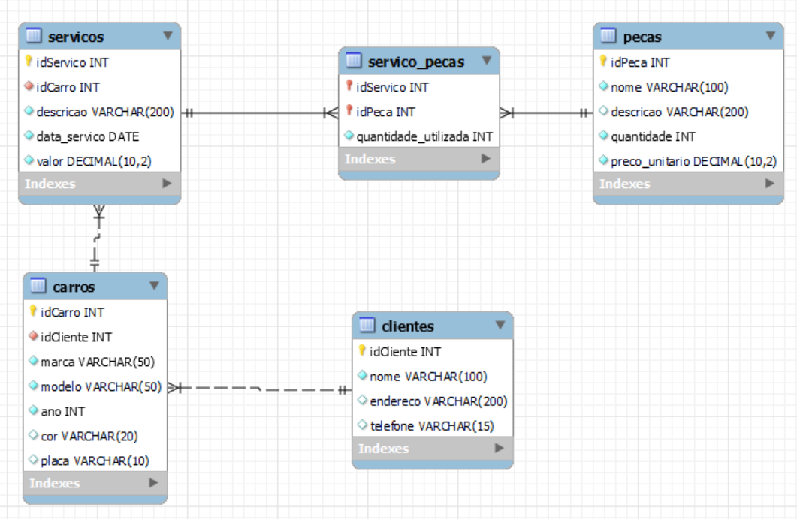

# Bootcamp Potência Tech - E-Commerce

  


# Sobre o Projeto

Desenolvido em Julho de 2023 durante o bootcamp **Potência Tech Powered by iFood | Ciência de Dados com Python!** oferecido pela **Digital Innovation One (DIO)** 
em parceria com a **IFood**, o projeto apresenta um exemplo de banco de dados de um e-commerce. Foram inseridas queries e criadas tabelas seguindo o modelo proposto 
durante as aulas.


# Índice

- <a href = "#Regras-de-Negócio">Regras de Negócio</a>
- <a href = "#Projeto">Projeto</a>
- <a href = "#Autor">Autor</a>

  
# Regras de Negócio

Replique a modelagem do projeto lógico de banco de dados para o cenário de e-commerce. Fique atento as definições de chave primária e estrangeira, 
assim como as constraints presentes no cenário modelado. Perceba que dentro desta modelagem haverá relacionamentos presentes no modelo EER. 
Sendo assim, consulte como proceder para estes casos. Além disso, aplique o mapeamento de modelos aos refinamentos propostos no módulo de modelagem conceitual.

O projeto deve conter:

- Mapeamento do esquema ER para Relacional
- Definição do script SQL para criação do esquema de banco de dados
- Persistência de dados para testes
- Recuperação de informações com queries SQL

Assim como demonstrado durante o desafio, realize a criação do Script SQL para criação do esquema do banco de dados. Posteriormente, realize a persistência
de dados para realização de testes. Especifique ainda queries mais complexas dos que apresentadas durante a explicação do desafio. Sendo assim, 
crie queries SQL com as cláusulas abaixo:

- Recuperações simples com SELECT Statement
- Filtros com WHERE Statement
- Crie expressões para gerar atributos derivados
- Defina ordenações dos dados com ORDER BY
- Condições de filtros aos grupos – HAVING Statement

Deste modo, o projeto deve: 

- Criar junções entre tabelas para fornecer uma perspectiva mais complexa dos dados
Diretrizes
- Não há um mínimo de queries a serem realizadas;
- Os tópicos supracitados devem estar presentes nas queries;
- Elabore perguntas que podem ser respondidas pelas consultas;
- As cláusulas podem estar presentes em mais de uma query;
- Ser adicionado a um repositório do Github para futura avaliação do desafio de projeto. Adicione ao Readme a descrição do projeto
lógico para fornecer o contexto sobre seu esquema lógico apresentado.


# Projeto

Inicialmente, foi realizado o mapeamento do Diagrama de Entidade e Relacionamento, facilitando a visualização e abstração dos conceitos para a modelagem.




A partir da interpretação do esquema, foram implementados os códigos para a criação das tabelas e inserção dos dados para a persistência, como 
demonstrado no exemplo abaixo:

```mySql
-- Table: produtosFornecedores (Product / Supplier)
CREATE TABLE produtosFornecedores (
    idProdutoFornecedorProduto INT,
    idProdutoFornecedorFornecedor INT,
    quantidade INT NOT NULL,
    PRIMARY KEY (idProdutoFornecedorProduto, idProdutoFornecedorFornecedor),
    CONSTRAINT fk_produtoFornecedor_produto FOREIGN KEY (idProdutoFornecedorProduto) REFERENCES produtos (idProduto),
    CONSTRAINT fk_produtoFornecedor_fornecedor FOREIGN KEY (idProdutoFornecedorFornecedor) REFERENCES fornecedores (idFornecedor)
);

-- Insert random data into clientes (Customers)
INSERT INTO clientes (dataNascimento, primeiroNome, nomeMeio, sobrenome, endereco)
VALUES
    ('1990-03-15', 'João', 'A.', 'Silva', 'Rua dos Flores, 123'),
    ('1985-11-20', 'Maria', NULL, 'Santos', 'Av. das Palmeiras, 456'),
    ('2002-07-03', 'Pedro', 'C.', 'Lima', 'Praça das Águas, 789'),
    ('1978-09-12', 'Ana', 'M.', 'Ferreira', 'Alameda dos Pássaros, 321'),
    ('1995-05-30', 'Lucas', 'B.', 'Souza', 'Travessa das Estrelas, 987');
```

Foram elaboradas 4 perguntas utilizando queries:

## Qual é a Quantidade de Produtos em Estoque em cada Região?

Esta query retorna a quantidade de produtos filtrando o banco por localidade:

```mySql
SELECT localidade, SUM(quantidade) AS quantidade_em_estoque
FROM estoquesProdutos
GROUP BY localidade;
```

O código apresenta a soma das quantidades de produtos em estoque, sendo agrupados por região:


## Quais Produtos Apresentam Nota Maior ou Igual a 4.5?

 Essa query retorna o nome do produto e sua nota, filtrando os dados em relação a pergunta estabelecida:

```mySql
SELECT nomeProduto, avaliacao FROM produtos WHERE avaliacao >= 4.5;
```

Dentre os dados inseridos na tabela, notamos que o Smartphone possui a melhor nota, além de concluir que 2 produtos estão com nota inferior ao valor estipulado.


## Quais Produtos Custam Mais que R$ 100,00?

Esta query retorna a lista dos produtos com o valor maior que R$ 100,00 sendo classificados do mais caro para o mais barato:

```mySql
SELECT nomeProduto
FROM produtos
WHERE valor > 100
ORDER BY valor DESC;
```


## Quantos Clientes Estão Cadastrados no Sistema?

Esta query retorna a soma de todos os registros do banco de dados:

```mySql
SELECT COUNT(*) AS total_clientes FROM clientes;
```


É importante destacar que no início do script foi adicionada uma validação que verifica se o banco de dados 
existe e o exclui caso exista. É uma medida preventiva para garantir que o banco de dados esteja limpo e sem 
informações residuais antes de criar todas as tabelas novamente.
Dessa forma, ao executar o script várias vezes, ele garantirá que não haja problemas de duplicação ou conflitos.

```mySql
-- Drop the database if it exists
DROP DATABASE IF EXISTS ecommerce_refinado;

-- Create the database
CREATE DATABASE ecommerce_refinado;
USE ecommerce_refinado;
```

# Autor

- [Phelipe Augusto Tisoni](https://www.linkedin.com/in/phelipetisoni "Phelipe Linkedin")
